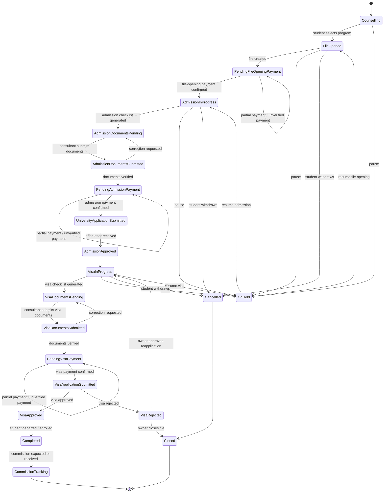
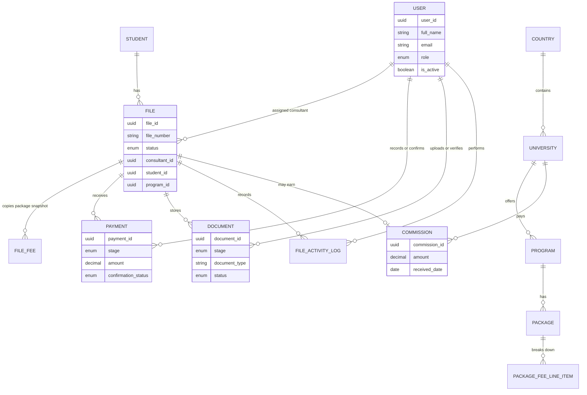

# Application Mermaid Diagram
## Student Abroad Admission Agency Management System

This document visualizes the full application from the business documentation and all business flow files.

Source documents:

- [Business Domain Documentation](business_domain_documentation.md)
- [Users and Roles](users_and_roles.md)
- [Business Flows Index](flows/00_business_flows_index.md)

## Full Application Flow

```mermaid
flowchart LR
    Student["Student"]
    University["University"]
    Embassy["Embassy / Immigration Authority"]

    subgraph OwnerArea["Owner / Admin"]
        F12["12. User Management"]
        F01["01. Catalog and Package Setup"]
        OwnerReports["Owner Reports and Oversight"]
        F07["07. University Commission Tracking"]
    end

    subgraph ConsultantArea["Consultant / Counsellor"]
        F02["02. Counselling and Program Selection"]
        F03["03. File Opening"]
        ConsultantFollowup["Student Follow-up and Document Collection"]
    end

    subgraph AccountsArea["Accounts Department"]
        F04Open["04. File Opening Payment Gate"]
        F04Admission["04. Admission Payment Gate"]
        F04Visa["04. Visa Payment Gate"]
        Dues["Due Calculation and Deposit Confirmation"]
    end

    subgraph AdmissionArea["Admission Department"]
        F05["05. Admission Processing"]
        AdmissionDocs["Admission Checklist and Document Verification"]
        OfferLetter["Offer Letter / Acceptance Letter"]
    end

    subgraph VisaArea["Visa Department"]
        F06["06. Visa Processing"]
        VisaDocs["Visa Checklist and Document Verification"]
        VisaOutcome["Visa Outcome"]
    end

    subgraph SystemArea["System-wide Controls"]
        F10["10. Access Control and Role Visibility"]
        F09["09. Notifications and Communication"]
        F08["08. Reporting and Dashboard"]
        ActivityLog["File Activity Log and Audit Trail"]
        F11["11. Exception and File Closure"]
    end

    F12 --> F10
    F12 --> F08
    F01 --> F02
    Student --> F02
    F02 -->|"student chooses program"| F03
    F03 -->|"file opened and package snapshot copied"| F04Open
    F04Open --> Dues
    F04Open -->|"payment cleared"| F05
    F05 --> AdmissionDocs
    AdmissionDocs -->|"missing or incorrect documents"| ConsultantFollowup
    ConsultantFollowup --> AdmissionDocs
    Student -->|"provides documents and payments"| ConsultantFollowup
    F05 -->|"admission-stage payment needed"| F04Admission
    F04Admission --> Dues
    F04Admission -->|"payment cleared"| F05
    F05 -->|"application submitted"| University
    University -->|"offer letter issued"| OfferLetter
    OfferLetter -->|"admission approved"| F06
    F06 --> VisaDocs
    VisaDocs -->|"missing or incorrect documents"| ConsultantFollowup
    F06 -->|"visa-stage payment needed"| F04Visa
    F04Visa --> Dues
    F04Visa -->|"payment cleared"| F06
    F06 -->|"visa application submitted"| Embassy
    Embassy -->|"decision returned"| VisaOutcome
    VisaOutcome -->|"approved and student departed / enrolled"| F11
    VisaOutcome -->|"rejected"| F11
    F11 -->|"completed file eligible for commission"| F07
    University -->|"commission paid"| F07
    F07 --> OwnerReports
    F08 --> OwnerReports

    F10 -.->|filters every screen and action| F01
    F10 -.->|filters every screen and action| F02
    F10 -.->|filters every screen and action| F03
    F10 -.->|filters every screen and action| F04Open
    F10 -.->|filters every screen and action| F05
    F10 -.->|filters every screen and action| F06
    F10 -.->|owner-only commission access| F07
    F09 -.->|event notifications| F03
    F09 -.->|event notifications| F04Open
    F09 -.->|event notifications| F05
    F09 -.->|event notifications| F06
    ActivityLog -.->|records status, payment, document, and user actions| F03
    ActivityLog -.->|records status, payment, document, and user actions| F04Open
    ActivityLog -.->|records status, payment, document, and user actions| F05
    ActivityLog -.->|records status, payment, document, and user actions| F06
    ActivityLog -.->|records user-management changes| F12
    F11 -.->|hold, cancellation, visa rejection, completion| F03
    F11 -.->|hold, cancellation, visa rejection, completion| F05
    F11 -.->|hold, cancellation, visa rejection, completion| F06
```

## File Lifecycle State Diagram

## Role and Workspace Map

```mermaid
flowchart TB
    subgraph InternalUsers["Internal System Users"]
        Owner["Owner / Admin"]
        Consultant["Consultant / Counsellor"]
        Accounts["Accounts Department User"]
        Admission["Admission Department User"]
        Visa["Visa Department User"]
    end

    subgraph ExternalActors["External Actors"]
        Student["Student"]
        University["University"]
        Embassy["Embassy / Immigration Authority"]
    end

    subgraph Workspaces["Application Workspaces"]
        UserMgmt["User Management"]
        Catalog["Country, University, Program, Package Catalog"]
        Counselling["Counselling and Program Selection"]
        FileMgmt["Student File Management"]
        Payments["Payments, Dues, Deposit Confirmation"]
        AdmissionDesk["Admission Workbench"]
        VisaDesk["Visa Workbench"]
        Commission["University Commission Tracking"]
        Reports["Reports and Dashboards"]
        Notifications["Notifications and Tasks"]
    end

    Owner --> UserMgmt
    Owner --> Catalog
    Owner --> FileMgmt
    Owner --> Payments
    Owner --> AdmissionDesk
    Owner --> VisaDesk
    Owner --> Commission
    Owner --> Reports

    Consultant --> Counselling
    Consultant --> FileMgmt
    Consultant --> Notifications
    Consultant --> Catalog

    Accounts --> Payments
    Accounts --> Reports
    Accounts --> Notifications

    Admission --> AdmissionDesk
    Admission --> Notifications

    Visa --> VisaDesk
    Visa --> Notifications

    Student --> Counselling
    Student --> FileMgmt
    Student --> Payments
    Student --> AdmissionDesk
    Student --> VisaDesk

    University --> Catalog
    University --> AdmissionDesk
    University --> Commission

    Embassy --> VisaDesk

    UserMgmt -.->|Owner only| Owner
    Commission -.->|Owner only| Owner
    Payments -.->|deposit confirmation by Accounts| Accounts
    FileMgmt -.->|consultant sees own files only| Consultant
```

## Core Data Relationship Map

## Flow Coverage Checklist

| Flow | Covered In Diagram |
|---|---|
| 01. Catalog and Package Setup | Full Application Flow, Role and Workspace Map, Core Data Relationship Map |
| 02. Counselling and Program Selection | Full Application Flow, File Lifecycle State Diagram, Role and Workspace Map |
| 03. File Opening | Full Application Flow, File Lifecycle State Diagram, Core Data Relationship Map |
| 04. Payment and Deposit Confirmation | Full Application Flow, File Lifecycle State Diagram, Role and Workspace Map |
| 05. Admission Processing | Full Application Flow, File Lifecycle State Diagram, Role and Workspace Map |
| 06. Visa Processing | Full Application Flow, File Lifecycle State Diagram, Role and Workspace Map |
| 07. University Commission Tracking | Full Application Flow, Role and Workspace Map, Core Data Relationship Map |
| 08. Reporting and Dashboard | Full Application Flow, Role and Workspace Map |
| 09. Notifications and Communication | Full Application Flow, Role and Workspace Map |
| 10. Access Control and Role Visibility | Full Application Flow, Role and Workspace Map |
| 11. Exception and File Closure | Full Application Flow, File Lifecycle State Diagram |
| 12. User Management | Full Application Flow, Role and Workspace Map |
